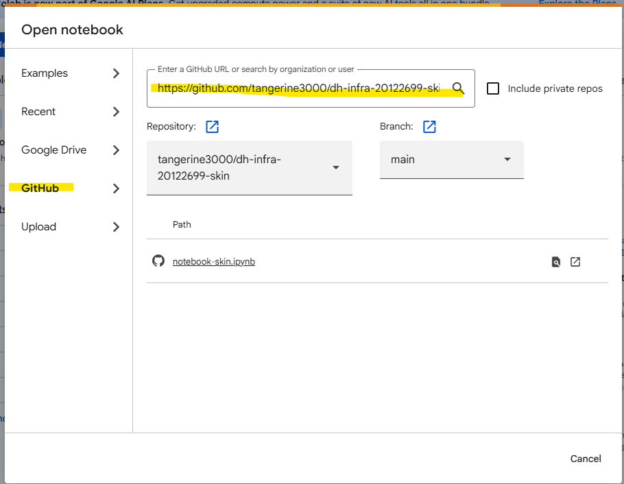

# Milestone 1 Peer Grading Rubric
Refer to [Milestone-1-Peer-Grading-Rubric-Dermalens](Milestone-1-Peer-Grading-Rubric-Dermalens.md) for details on how the dh-infra-20122699-skin project meets all Milestone 1 requirements.

This project in particular the Jupyter Notebook was created to meet all the milestone 1 requirements
**[View the Jupyter Notebook](notebook-skin.ipynb)** | **[Open in Google Colab](https://colab.research.google.com/github/tangerine3000/dh-infra-20122699-skin/blob/main/notebook-skin.ipynb)**

**Quick Start:** [Running the Notebook](#running-the-notebook)


# Dermalens Skin Data Pipeline

This project prepares and processes the Dermalens skin lesion dataset for machine learning workflows in a Jupyter notebook environment, with support for cloud storage and parquet-based data handling.


## Project Overview

This repository contains a notebook-based workflow for:

- downloading or locating dataset split parquet files
- combining raw data into a single dataset
- deriving a binary label (`label = 1` for malignant classes, `0` otherwise)
- removing duplicate rows while preserving metadata integrity
- creating grouped, stratified train/dev/test splits
- generating cross-validation folds from the training data
- writing processed parquet outputs to Google Cloud Storage


## Running the Notebook

Recommended Option 1 for quick setup and running scripts

### Option 1: Open the notebook in Google Colab from GitHub

You can open the notebook directly in Colab by using the GitHub URL:

https://github.com/tangerine3000/dh-infra-20122699-skin/blob/main/notebook-skin.ipynb

Then do the following:

1. Open the GitHub notebook link in your browser.
2. Click the "Open in Colab" button if it appears on the GitHub page.



3. If the button is not visible, use the Colab URL pattern below:

```text
https://colab.research.google.com/github/tangerine3000/dh-infra-20122699-skin/blob/main/notebook-skin.ipynb
```

4. In Colab, install the required dependencies:

```python
!pip install -r requirements.txt
```

If a file is not available in the notebook environment, install the missing packages manually:

```python
!pip install pandas numpy pyarrow scikit-learn google-cloud-storage datasets Pillow matplotlib
```

5. Authenticate to Google Cloud if you need to read/write GCS data:

```python
from google.colab import auth
auth.authenticate_user()
```

6. Before running the notebook, ensure the cloud bucket and paths match your project environment.

### Option 2: Open directly in Jupyter locally

Before running the notebook locally, make sure you have the following installed:

- Python 3.10 or 3.11
- Jupyter Notebook or JupyterLab
- `pip` and virtual environment support
- The project dependencies from `requirements.txt`

Install the required packages for a local notebook environment:

```bash
python -m venv .venv
source .venv/bin/activate   # macOS/Linux
.venv\Scripts\activate      # Windows
pip install -r requirements.txt
```

If you want to install the core notebook stack explicitly, use:

```bash
pip install pandas numpy pyarrow scikit-learn google-cloud-storage jupyter ipykernel datasets Pillow matplotlib
```

Then open the notebook in Jupyter and run the cells in order:

```bash
jupyter notebook notebook-skin.ipynb
```

Or in JupyterLab:

```bash
jupyter lab
```

## Additional References

- `Dataset_README.md` for dataset-specific context
- `requirements.txt` for the project dependency list
- the notebook cells for pipeline logic and Cloud Storage uploads
